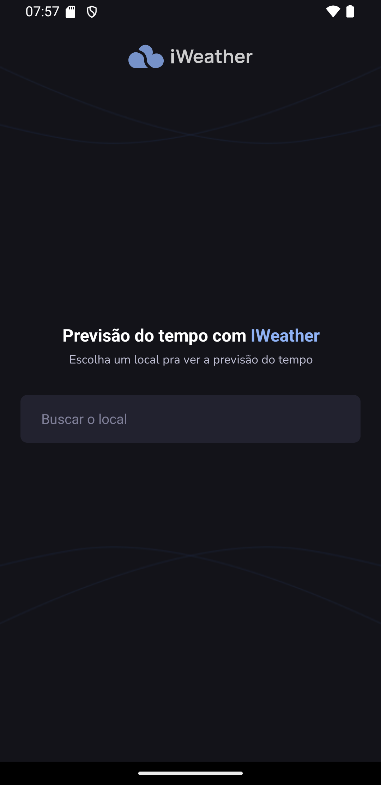
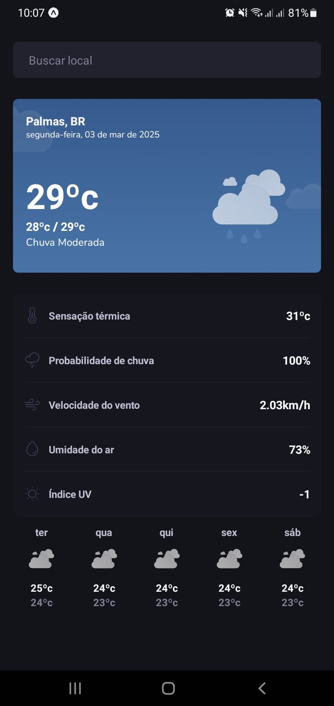

# Rn-IWEATHER

## Ferramenta Mobile 

- Aplicação usando React Native
- Usando Expo
- NativeWind
- Async-Storage
- Axios
- Zod
- Clsx
- Jest
- Testing-library/react-native
- https://openweathermap.org

## Rodar o projeto Mobile

- primeiro instalar o nodejs versão LTS
- npm install para instalar todas as dependência
- npm start ou npx  expo  start para executar o projeto 
  

